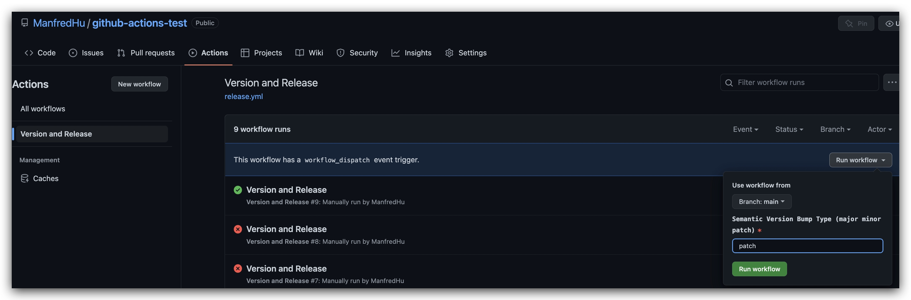

# Github Actions 个人使用经验
## npm-bump 自动更新版本号后发布npm

使用方式如 `.github/workflows/npm-bump-release.yml`

会自动升级版本号，然后发布到 npm

## github 环境变量
[github 环境变量](https://docs.github.com/en/actions/learn-github-actions/contexts)