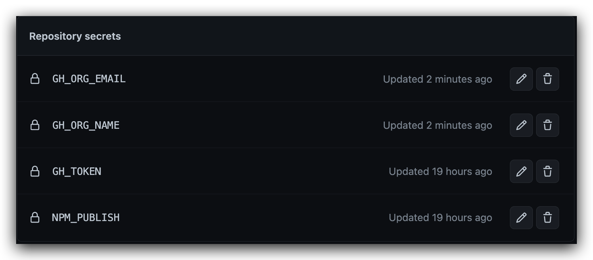

# Github Actions 个人使用经验
## npm-bump 自动更新版本号后发布npm

使用方式如 `.github/workflows/npm-bump-release.yml`

会自动升级版本号，然后发布到 npm

## 高级玩法
比如dev为开发分支，通过Github PullRequest功能合并代码，则通过如下配置可以实现自动更新版本和发布等操作

### 监听dev分支PR自动Comment提示设置版本号

使用方式如 `.github/workflows/dev-pr-open.yml`

### 监听 Label变化 自动Check版本变更

使用方式如 `.github/workflows/dev-pr-label.yml`

如果没有版本变更的Labels则无法合并代码分支

### 关闭PR自动发布

使用方式如 `.github/workflows/dev-pr-close.yml`

通过上面的labels设置了需要升级的版本号 `major` `minor` `patch`，则可以通过关闭PR来触发自动发布

因为需要执行`npm version major/minor/patch`命令，必须设置Email和Name

## pull-request-labels PR自动打标升级版本号发布npm

参考: [github-actions-npm-version-bump-using-labels-on-pr-merge](https://medium.com/@johnathanmiller/github-actions-npm-version-bump-using-labels-on-pr-merge-8c716a488a64)

## github 环境变量
[github 环境变量](https://docs.github.com/en/actions/learn-github-actions/contexts)